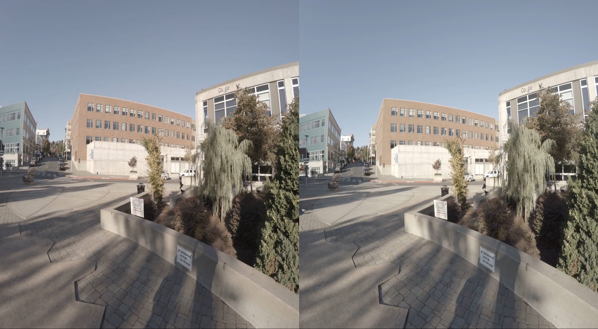
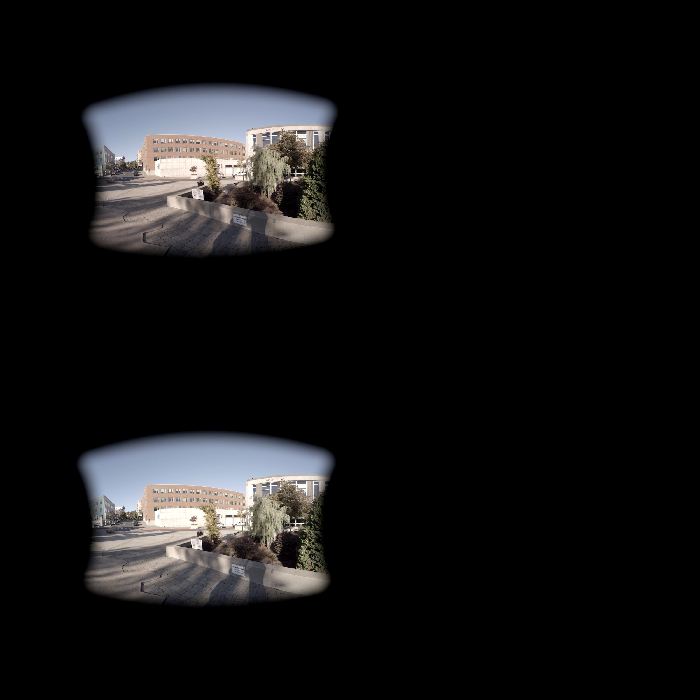

# VR180 Video Format

# 1. Introduction

VR180 cameras are a new category of VR camera that use two wide angle cameras to
capture the world as you see it with point and shoot simplicity. This document
describes the video format output by these devices. The choice considers the
following aspects:

*   **FOV**: VR180 cameras capture sub-360 FOV rather than full 360. It is
    important to retain the original pixel density of the camera sensors in
    order to provide high pixel density for VR viewing.
*   **Projection**: Different versions of VR180 cameras may have different lens
    and different camera projections. As such the file format should be
    camera-independent.
*   **Motion**: The cameras can often be non-stationary due to unintentional
    shakes or intentional motion, for example, handheld capture of events or
    people. To avoid motion sickness, camera motion metadata should be saved for
    stabilized playback.
*   **Playback**: The file format should be friendly enough for local playback
    so that manufacturers can easily build their apps. Android and iOS should
    have an easy way to play the raw video.

VR180 videos contain two types of metadata to jointly define the projection from
video frames to their partial viewports within a spherical coordinate system.

1.  **A global static projection** that defines the mapping from the pixels to
    local spherical coordinate systems, typically to only a sub-180 FOV part.
    The [Spherical Metadata V2
    Spec](https://github.com/google/spatial-media/blob/master/docs/spherical-video-v2-rfc.md)
    is adopted here to encode this global metadata. (See details in [section
    2](#2-mesh-projection)).
2.  **A dynamic orientation stream** that defines the rotation between the local
    coordinate system of each frame and the world coordinate system. A new
    [Camera Motion Metadata
    track](https://developers.google.com/streetview/publish/camm-spec) is
    created for encoding such per-frame metadata. (See [section
    3](#3-camera-motion-metadata)).

# 2. Mesh Projection

The [Spherical Metadata V2
Spec](https://github.com/google/spatial-media/blob/master/docs/spherical-video-v2-rfc.md)
should be present in the file to define the static global projection of
individual frames to their local spherical coordinate system. Among the allowed
projection types by Spherical Metadata V2, the VR180 Video format requires a
mesh projection, which is most generic and works for fisheye projection.

{\:height="60%" width="60%"} | 
:-------------------------------------------------------: | :---------------------:
(a) 360 equirectangular                                   | (b) fisheye mesh projection

Figure 1. Example of video frame in typical equirectangular format and the mesh
format.

By using the mesh projection type, the cameras can save the raw pixels in
side-by-side or over-under format in the video, and let the projection meshes
define the back-projection from pixels to the 3D directions. This not only
preserves the pixel density of the camera sensors, but also saves production
cost and power consumption by shaving off expensive reprojection computation. To
render such videos, player clients simply need to draw the saved per-eye mesh
with their corresponding image as texture. To be specific in VR180:

*   Dual stereo mesh: video files contain two meshes, one mesh for each eye.
*   Fisheye projection: geometry-wise, the video frames are simple
    concatenations of left and right views with possible crop and rescale, but
    there is no other type of warping (e.g. de-fisheye).
*   Stereo mode: for better compatibility with video streaming services that are
    optimized for 16:9, landscape LEFT-RIGHT is preferred over portrait
    TOP-BOTTOM.

## Mesh Generation

Once the cameras are calibrated, the mesh vertices can be generated by
straightforward back-projection for a grid of coordinates that cover the valid
image portion (inside 180 image circle). Refer to the
[appendix](#appendix-mesh-generation-demo) for a complete Matlab demo code for
producing a full mesh for a fisheye camera. Below is the pseudo code for getting
a single mesh vertex.

```matlab
% Returns the mesh vertex for an image point image_x, image_y for an eye.
% (width, height) : the size of the image of an eye.
% (image_x, image_y): image coordinate where (0, 0) and (width, height) are top-left
%                     and bottom-right corner respectively.
% eye_camera : the calibrated camera for an eye (left or right)
function [x, y, z, u, v] = GetMeshVertex(width, height, image_x, image_y, eye_camera)
  % Unit ray direction corresponding the pixel
  [x, y, z] = PixelToRay(eye_camera, image_x, image_y);
  % Negate Y and Z IF the camera parameterization follows standard Computer Vision
  % convention where Y points down and Z points forward. This is to account the
  % difference with OpenGL coordinate system.
  [x, y, z] = [x, -y, -z];
  % Normalized OpenGL coordinate for the pixel, where the V coordinate needs to be flipped.
  u = image_x / width;
  v = (height - image_y) / height;
end
```

*   Although the video frame is a concatenation of left and right eye images
    (LEFT-RIGHT or OVER-UNDER), the mesh for each eye should be generated as if
    they are separate images.
*   A coarse mesh is preferred over a full-resolution mesh. Downsampled meshes
    work well as long as the resolution is reasonable, and they are more
    efficient for playback. A typical mesh resolution is a 40x40 grid.

# 3. Camera Motion Metadata

Camera rotations during video capture in a world coordinate system can be
embedded as video metadata. This metadata is particularly important for
hand-held VR video:

*   By using camera rotation metadata, the player can render the video frames at
    the exact orientation they were captured. The compensation of the camera
    rotation essentially keeps the distant background static. Our experiments
    have shown such stabilized viewing significantly reduces the motion sickness
    issue for VR.
*   It is important to have high quality rotation data (including correct
    gravity vector), otherwise the playback can cause motion sickness or be
    disorienting. This basically requires a well-calibrated IMU along with
    on-device sensor fusion.

{:height="30%" width="30%"} {:height="30%" width="30%"} {:height="30%" width="30%"}

Figure 2. Three equirectangular stereo views generated according to their
rotations.

## Camera Motion Metadata Track

We have created a new [Camera Motion Metadata
Track](https://developers.google.com/streetview/publish/camm-spec) for storing
various kinds of camera motion metadata, including camera orientation, gyroscope
reading, accelerometer readings, etc. The custom metadata track can be
identified by the new Camera Motion Metadata (camm) Sample Entry box.

In the application of VR180 camera, each video contains such a metadata track to
store camera rotation data. Each data sample in the metadata track is
represented as bitstream in the following format

<table>
  <tr>
    <td> Fields:           </td>
    <td>Description: </td>
  </tr>
  <tr>
    <td> int32 reserved;     </td>
    <td>Should be 0.</td>
  </tr>
  <tr>
    <td> float32 angle_axis[3];</td>
    <td>Angle axis orientation in radians representing the rotation from camera coordinate system to world coordinate system.<br>
        Let M be the 3x3 rotation matrix corresponding to the angle axis vector. For any ray X in the local coordinate system, <br>
      the ray direction in the world coordinate is M * X.<br>
<br>
Such orientation information can be obtained by running 3DoF sensor fusion on the device. After integrating the IMU readings, <br>
      only the integrated global orientation needs to be recorded. <br>
          <br>
      Below is an example c++ code for converting from matrix to the expected angle axis using <a href="https://eigen.tuxfamily.org/dox/">Eigen3</a>.
<pre lang="cpp">Eigen::Matrix3f M = get_current_rotation_matrix();
Eigen::AngleAxisf aa(M);
Eigen::Vector3f angle_axis = aa.angle() * aa.axis(); </pre>
       </td>
  </tr>
</table>

*   The coordinate systems are right-hand sided. The camera coordinate system is
    defined as X pointing right, Y pointing downward, and Z pointing forward.
    The Y-axis of the global coordinate system should point down along the
    gravity vector.


*   IMU readings are typically in its own IMU coordinate system, and necessary
    rotation is needed to map them to the camera coordinate system if the two
    coordinate systems are different.
*   To have a consistent viewing experience, we recommend resetting the yaw
    angle for each new video recording, such that the orientation of the first
    frame has a yaw angle of 0.
*   All fields are little-endian and least significant bit first, and the 32-bit
    floating points are of IEEE 754-1985 format. The video recorder should
    maintain a struct of these fields in memory and copy the raw data to video
    packets.

Synchronization between metadata and video frames.

*   Video track and metadata track are synchronized by the presentation
    timestamp of the video and metadata samples.
*   Given the camera orientation for a discrete set of metadata presentation
    time, the continuous orientation for any given time is defined by linear
    interpolation of neighboring camera orientations. When rendering a video
    frame, player should obtain the frame rotation by linear interpolation using
    the presentation time of the video frame.
*   Typical presentation time for a video frame is the start of frame exposure,
    which does not take into account of exposure time and rolling shutter. When
    per-frame exposure time and rolling shutter are known, better
    correspondences can be achieved by adjusting the presentation time of the
    video frames to the middle of frame exposure duration:
    exposure_start_of_first_row + (pixel_exposure_time + rolling_shutter_skew)
    /2.

# 4. Identifying VR180 Videos

Below is an example box structure of a VR180 video:

```
[moov]
  [trak]                   // video track
    [mdia]
      [minf]
        [stbl]
          [stsd]
            [avc1]
              [st3d]      // spherical metadata v2
              [sv3d]      // spherical metadata v2
               ...
  [trak]                  // audio track
         ...
  [trak]                  // camera motion data track
    [mdia]
      [hdlr]              // handler = ‘meta’
      [minf]
        [stbl]
          [stsd]
             [camm]       // camera motion sample entry
```

The VR180 videos can be identified for custom processing or playback by the
existence and the content of Spherical Video Metadata V2. Optionally, the camera
motion metadata track provides the stabilization that aligns the video frames
with a fixed world orientation.

# Appendix - Mesh Generation Demo

```matlab
% Demo code for mesh generation from a fisheye camera. The format of the mesh
% vertices and triangle indices are generated according to the definition of
% ProjectionMesh in Spherical Video V2 (
% https://github.com/google/spatial-media/blob/master/docs/spherical-video-v2-rfc.md)
%
% Note for stereo image that are composed of two sub-images for left and right
% eyee, the meshes should be generated from the individual cameras that describe
% the sub-images of each eye as if they are separated.
%
% Please note that Computer Vision typically uses a coordinate system such X
% points right, Y points downward, and Z points forward, which has negated Y and
% Z compared to OpenGL. To generate a mesh from such a camera, Y and Z
% coordinates need to be negated, and texture coordinate V needs to be flipped
% similarly.
%
function spherical_mesh_demo()
  % Example fisheye camera for the demo.
  fisheye_camera = demo_camera();

  % Mesh resolution.
  grid_size_x = 40;
  grid_size_y = 40;

  % Generate the vertices and triangle indices from the camera.
  [vertices, tri] = generate_mesh(fisheye_camera, grid_size_x, grid_size_y);

  % Plot the UV triangulation in the image space.
  figure(1);
  u = reshape([vertices(:).u], grid_size_y, grid_size_x);
  v = reshape([vertices(:).v], grid_size_y, grid_size_x);
  trimesh(tri, u * fisheye_camera.image_size(1), ...
          v * fisheye_camera.image_size(2));
  set(gca, 'xlim', [0, fisheye_camera.image_size(1)],...
      'ylim', [0, fisheye_camera.image_size(2)]);
  axis equal;

  % Plot the mesh in 3D.
  figure(2);
  x = reshape([vertices(:).x], grid_size_y, grid_size_x);
  y = reshape([vertices(:).y], grid_size_y, grid_size_x);
  z = reshape([vertices(:).z], grid_size_y, grid_size_x);
  trimesh(tri, x, y, z);
  axis equal;
end


% Generate the mesh vertices and triangle indices using a grid in the
% intersection of 180 image circle and the image rectangle.
function [vertices, tri] = generate_mesh(fisheye_camera, grid_size_x,...
                                         grid_size_y)
  % Struct for the mesh vertex
  vertices = struct('u', {}, 'v', {}, 'x', {}, 'y', {}, 'z', {});

  %  The radius along x-axis and y-axis, assuming an ellipse shape.
  radius = image_circle(fisheye_camera);

  % The vertical boundary of the image circle/ellipse.
  ymin = max(0, fisheye_camera.principal_point(2) - radius(2));
  ymax = min(fisheye_camera.image_size(2),...
             fisheye_camera.principal_point(2) + radius(2));

  for i = 1 : grid_size_y;
    % Y coordinate in the image.
    yi = ymin + (i - 1) * (ymax - ymin) / (grid_size_y - 1);
    % Y coordinate relative to image center.
    yc = yi - fisheye_camera.principal_point(2);

    % Horizontal boundary on the image circle along the given y coordinate.
    rx = radius(1) * sqrt(1 - yc^2 / (radius(2)^2));
    xmin = max(0, fisheye_camera.principal_point(1) - rx);
    xmax = min(fisheye_camera.image_size(1), ...
               fisheye_camera.principal_point(1) + rx);

    % Generate evenly spaced vertices along the horizontal line.
    for j = 1 : grid_size_x;
      % X coordinate
      xj = xmin + (j - 1) * (xmax - xmin) / (grid_size_x - 1);
      point = pixel_to_ray(fisheye_camera, xj, yi);

      % X, Y, Z, U, V for each vertex. To account for the difference between
      % normal Computer Vision coordinate and OpenGL coordinate, the Y and Z
      % coordinate of the needs to be negated, and V needs to be flipped.
      % If you are already using an OpenGL like coordinate system, this will
      % not be needed.
      vertices(i, j).x = point(1);
      vertices(i, j).y = - point(2);
      vertices(i, j).z = - point(3);
      vertices(i, j).u = xj / fisheye_camera.image_size(1);
      vertices(i, j).v = 1 - yi / fisheye_camera.image_size(2);
    end
  end

  % Generate triangle indices for the mesh.
  for j = 0 : grid_size_x - 2;
    for i = 0 : grid_size_y - 2;
      % Split the quad (i , i + 1) x (j, j + 1) to two triangles:
      tri(end + 1, :) = [grid_size_y * j + i + 1,...
                         grid_size_y * (j + 1) + i + 1,...
                         grid_size_y * j + i + 2];
      tri(end + 1, :) = [grid_size_y * j + i + 2,...
                         grid_size_y * (j + 1) + i + 1,...
                         grid_size_y * (j + 1) + i + 2];
     end
  end
end

% The example camera uses a typical Computer Vision fisheye camera model, which
% projects a 3D points in the world coordinate system as follows:
%
% 1. Transform world_point to camera coordinate system:
%       camera_point = ...
%          camera.world_to_camera_rotation * (world_point - camera.position);
% 2. Fisheye mapping.
%      theta = atan2(norm(camera_point(1:2)), camera_point(3));
% 3. Radial distortion factors
%      d = camera.radial_distortion
%      normalized_r = theta + d(1) * theta^3 + d(2) * theta^5 + d(3) * theta^7.
%      normalized_x = normalized_r * camera_point(1) / norm(camera_point(1:2));
%      normalized_y = normalized_r * camera_point(2) / norm(camera_point(1:2));
% 4. Map the normalized coordinate to pixels
%     x = camera.focal_length * normalized_x + camera.principal_point(1)
%     y = camera.focal_length * camera.pixel_aspect_ratio * normalized_y ...
%         + camera.principal_point(2);
function fisheye_camera = demo_camera()
  fisheye_camera = struct('image_size', [2160, 2160], ...
                          'principal_point', [1080, 1080], ...
                          'pixel_aspect_ratio', 1.2, ...
                          'focal_length', 828, ...
                          'radial_distortion', [-0.032, -0.00243, 0.001],...
                          'world_to_camera_rotation', eye(3), ...
                          'position', [0, 0, 0]);
end

% Map a pixel (x, y) to the ray direction in the world coordinate.
%
% Note this needs to be modified for cameras with different parametrization.
function point = pixel_to_ray(fisheye_camera, x, y)
  % Normalized Y coordinate.
  yn = (y - fisheye_camera.principal_point(2))/ fisheye_camera.focal_length ...
       / fisheye_camera.pixel_aspect_ratio;

  % Normalized X coordinate.
  xn = (x - fisheye_camera.principal_point(1)) / fisheye_camera.focal_length;

  % Normalized distance to image center.
  rn = sqrt(xn * xn + yn * yn);

  % Solve for the angle theta between the viewing ray and the optical axis
  % that satisfies:
  %   rn = theta + theta^3 * d(1) + theta^5 * d(2) + theta^7 * d(3);
  % The example uses just 3 parameters, but it can easily extended to more.
  d = fisheye_camera.radial_distortion;
  theta = roots([d(3), 0, d(2), 0, d(1), 0, 1.0, -rn]);

  % Take the smallest positive real solution.
  theta = min(theta(find(imag(theta) == 0 & real(theta) > 0)));
  % Degenerate case in exact image center.
  if isempty(theta); theta = 0; end;

  % Generate the point in the world coordinate.
  point = [sin(theta) * xn / rn; sin(theta) * yn / rn; cos(theta)];

  % Apply the inverse rotation to transform it from camera to world.
  point = fisheye_camera.world_to_camera_rotation' * point;
end

% Calculate X- and Y-radius of the image circle/ellipse for a fisheye camera.
%
% Note the image circle logic needs to be modified for cameras with different
% parametrization, for example, having non-zero skew.
function radius = image_circle(fisheye_camera)
  % Half of the desired image circle. Note the maximum image circle should be
  % at most 180 degrees, but it is OK to make it smaller to avoid peripheral
  % with poor quality.
  theta = pi / 2;
  % Normalized distance to the image center.
  d = fisheye_camera.radial_distortion;
  normalized_r = theta + theta^3 * d(1) + theta^5 * d(2) + theta^7 * d(3);
  % Radius along X and Y axes.
  radius = normalized_r * fisheye_camera.focal_length...
           * [1, fisheye_camera.pixel_aspect_ratio];
end
```
